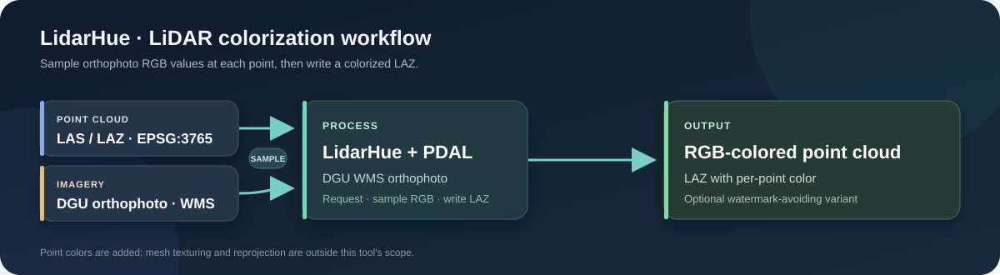

# LidarHue

**Colorize uncolored LiDAR point clouds with orthophoto imagery.**



LidarHue is a focused Windows batch utility for adding RGB values to LAS/LAZ
point clouds that have no point colors. It requests matching orthophoto imagery
from the Croatian State Geodetic Administration (DGU) WMS and uses PDAL to
sample the image color at each point. An optional second output shifts the WMS
request to keep its centered Geoportal watermark outside the tile.

> LidarHue writes point colors; it does not create or apply mesh textures, infer
> missing imagery, or reproject input point clouds. Inputs must use EPSG:3765.

## What it does

- Scans configured folders recursively for `.las` and `.laz` files.
- Reads each tile's bounds and requests the corresponding DGU orthophoto.
- Writes RGB LAZ outputs using PDAL `filters.colorization`.
- Optionally creates a watermark-avoiding variant by requesting a taller raster
  and cropping the target tile from below the watermark.
- Records per-file status and resumes by skipping existing outputs.

## Requirements

- Windows PowerShell 5.1 or PowerShell 7+
- Miniforge, Miniconda, or Conda
- Internet access to the configured DGU WMS
- Disk space for source files, downloaded rasters, and output LAZ files

The setup script provisions PDAL, GDAL's `gdal_translate`, and Python in a
dedicated Conda environment.

## Quick start

Run from the repository root:

```powershell
# Create the processing environment
powershell -ExecutionPolicy Bypass -File .\backend\scripts\setup_env.ps1

# Create your local configuration from the template
Copy-Item .\config.example.json .\config.json
```

Edit `config.json`: set `envRoot` to the environment path printed by the setup
script, then set each group's `source` to a folder containing LAS/LAZ files.
Paths can be relative to the repository root, absolute, or UNC. Do not commit
`config.json`; it is intentionally ignored because it contains machine-specific
paths.

```powershell
# Inspect configuration and planned requests without downloading or writing
.\backend\scripts\process_lidar_batch.ps1 -DryRun

# Start with one file
.\backend\scripts\process_lidar_batch.ps1 -MaxFiles 1

# Process all configured groups
.\backend\scripts\process_lidar_batch.ps1
```

## Outputs

By default, results are written under `finali/laz/<group>/`:

- `colored/` — colorized from an orthophoto request covering the tile.
- `no_center_watermark/` — colorized from the shifted-and-cropped request.

Temporary rasters, generated PDAL pipelines, logs, and resume status are stored
under `backend/`. These are local processing artifacts and are excluded from
Git. Set `output.keepRasters` to `false` in your local configuration to delete
intermediate ortho rasters after successful colorization.

## Options

| Option | Purpose |
| --- | --- |
| `-DryRun` | Show planned WMS requests without downloading or processing. |
| `-MaxFiles N` | Process at most N files per group. |
| `-GroupFilter NAME` | Select group names (wildcards are supported). |
| `-FileFilter PATTERN` | Select file names, e.g. `-FileFilter "*_452_*"`. |
| `-Variants colored\|no_center_watermark\|both` | Choose output variant(s). |
| `-Resolution METERS` | Override configured orthophoto pixel size for this run. |
| `-ShiftFactor N` | Override the extended request height for watermark avoidance. |
| `-Force` | Re-create outputs even when files already exist. |

The default pixel size is 0.25 m and the default shift factor is 2.2. Larger
requests can take longer or be rejected by the WMS; increase `resolution` or
reduce `shiftFactor` if the service refuses a request. Verify imagery and
outputs before running large batches.

## Configuration

Start from [`config.example.json`](config.example.json). It documents the
available settings and includes the DGU orthophoto WMS endpoint and layer.
Keep all local input, output, environment, and service-specific values in your
ignored `config.json`.

Important constraints:

- Input LiDAR coordinates are expected in EPSG:3765; automatic reprojection is
  not performed.
- Color quality depends on the source orthophoto, acquisition dates, and
  point-cloud/imagery alignment.
- `-DryRun` does not modify outputs, but normal runs can create or replace
  configured output files. Use `-Force` deliberately.
- Follow DGU service terms and applicable data licensing when using imagery.

## Repository layout

```text
backend/scripts/setup_env.ps1          # Conda environment setup
backend/scripts/process_lidar_batch.ps1 # Batch colorization
config.example.json                    # Portable configuration template
```

## License

No license has been assigned yet. Until a license is added, default copyright
applies; public visibility does not by itself grant permission to reuse the
code.
